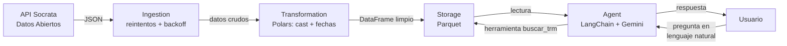

# FinSight

Pipeline de datos con un agente de IA que responde consultas en lenguaje natural sobre la Tasa Representativa del Mercado (TRM) del peso colombiano frente al dólar.

El proyecto ingiere datos oficiales desde la API de Datos Abiertos de Colombia, los transforma y almacena de forma reproducible, y expone una interfaz conversacional impulsada por un modelo de lenguaje que consulta los datos mediante herramientas.

---

## ¿Por qué este proyecto?

FinSight no busca impresionar por el análisis financiero, sino por la **ingeniería del pipeline**: ingesta resiliente, validación de calidad de datos, separación clara de responsabilidades y un agente que delega el trabajo de datos a la herramienta correcta en lugar de procesarlo todo en el contexto del modelo.

Es la base arquitectónica de un patrón reproducible de DataOps: la misma estructura puede aplicarse a cualquier fuente de datos cambiando únicamente el módulo de ingesta.

---

## Arquitectura



El flujo se divide en dos caminos independientes:

- **Pipeline de datos:** `ingestion → transformation → storage`. Descarga, limpia y persiste los datos en Parquet.
- **Consulta:** el agente lee el Parquet ya almacenado mediante una herramienta y responde. No vuelve a descargar datos en cada pregunta.

Esta separación permite que ambos caminos se ejecuten como servicios independientes al contenerizar el proyecto.

---

## Decisiones técnicas destacadas

| Decisión | Razón |
|---|---|
| **Reintentos con backoff exponencial** en la ingesta | La API externa puede fallar temporalmente (`503`). El pipeline reintenta con esperas crecientes (1s, 2s, 4s…) en lugar de morir al primer error. |
| **Validación "HTTP 200 ≠ datos válidos"** | Un `200 OK` con cuerpo vacío es un fallo silencioso. El pipeline trata la respuesta vacía como error y reintenta. |
| **Falla ruidosa (`fail fast`)** | Si se agotan los reintentos, la función relanza la excepción en vez de devolver `None`. Un fallo silencioso corrompe datos sin avisar. |
| **Separación de responsabilidades** | Cada módulo hace una sola cosa. Transformar no escribe a disco; consultar no descarga. |
| **Agente con herramientas, no contexto** | El modelo no recibe todos los datos en el prompt. Llama a una herramienta que filtra el Parquet con Polars y devuelve solo lo necesario. Escala y reduce costo de tokens. |
| **Almacenamiento en Parquet** | Formato columnar comprimido, ideal para datos analíticos y lecturas rápidas con Polars. |

---

## Stack

- **Python** — lógica del pipeline
- **Polars** — transformación y consulta de datos (columnar, alto rendimiento)
- **httpx** — cliente HTTP con soporte de timeouts
- **LangChain** — orquestación del agente
- **Gemini API** — modelo de lenguaje del agente
- **Parquet** — almacenamiento de datos
- **uv** — gestión de dependencias y entorno
- **pytest** — pruebas

---

## Estructura del proyecto

```
finsight/
├── src/
│   ├── ingestion/        # Descarga resiliente desde la API Socrata
│   ├── transformation/   # Limpieza y tipado con Polars
│   ├── storage/          # Persistencia en Parquet
│   └── agent/            # Agente LangChain + herramienta de consulta
├── tests/                # Pruebas con pytest
├── data/                 # Datos generados (Parquet) — no versionado
├── main.py               # Orquestación del pipeline completo
├── .env.example          # Plantilla de variables de entorno
├── pyproject.toml        # Dependencias (uv)
└── README.md
```

---

## Fuente de datos

Los datos provienen del dataset oficial de la TRM publicado en el portal de **Datos Abiertos de Colombia** (plataforma Socrata), que expone una API REST estable en formato JSON.

- **Dataset:** `32sa-8pi3`
- **Campos:** `valor` (TRM en COP), `unidad`, `vigenciadesde`, `vigenciahasta`
- **Particularidad:** la TRM no se recalcula fines de semana ni festivos, por lo que un mismo valor cubre un rango de fechas (`vigenciadesde` a `vigenciahasta`). La herramienta de consulta maneja esto filtrando por rango.

---

## Cómo ejecutarlo

### Requisitos

- Python 3.11+
- [uv](https://docs.astral.sh/uv/) instalado
- Una API key de Gemini ([Google AI Studio](https://aistudio.google.com/))

### Pasos

```bash
# 1. Clonar el repositorio
git clone <url-del-repo>
cd finsight

# 2. Instalar dependencias
uv sync

# 3. Configurar variables de entorno
cp .env.example .env
# Editar .env y agregar tu GEMINI_API_KEY

# 4. Ejecutar el pipeline completo
uv run main.py
```

### Ejemplo de uso

```
✅ Datos actualizados: 1000 registros en data/TRM.parquet

🤖 La TRM para el 15 de junio de 2026 fue de 3475.72.
   Entró en vigencia el 2026-06-13 y estuvo vigente hasta el 2026-06-16.
```

---

## Roadmap

FinSight es el proyecto base de una arquitectura que se extiende por fases:

- [x] **v1 — DataOps:** pipeline de ingesta, transformación, almacenamiento y agente de consulta.
- [ ] **v2 — MLOps:** modelo predictivo de la TRM, versionado con MLflow y API de servicio con FastAPI.
- [ ] **Contenerización:** Dockerfile multi-stage y orquestación con Docker Compose.
- [ ] **CI/CD:** pipeline automatizado de lint, test y despliegue con GitHub Actions.

---

## Notas

Proyecto desarrollado como ejercicio de ingeniería de datos y MLOps, con énfasis en prácticas de producción: resiliencia ante fallos, validación de calidad de datos, reproducibilidad y arquitectura modular.