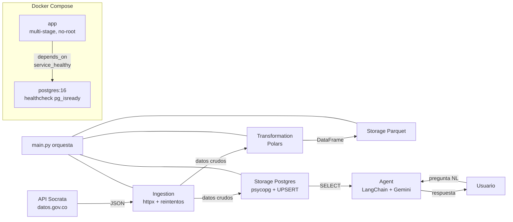
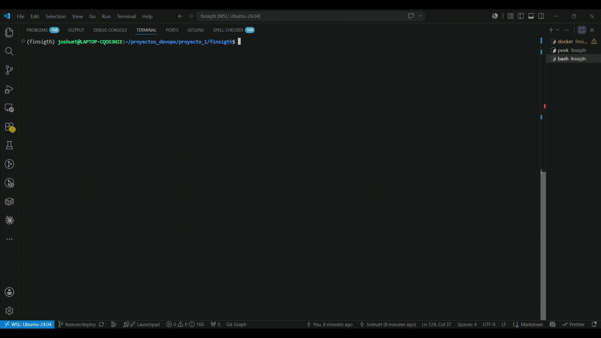

# FinSight


Pipeline DataOps que ingesta la TRM (Tasa Representativa del Mercado COP/USD) desde la API de Datos Abiertos de Colombia, la persiste en Postgres y Parquet, y expone un agente conversacional para consultarla en lenguaje natural.

**Repo:** https://github.com/JOSHUETDAVID/finsight

---

## Arquitectura



---

## Decisiones técnicas

| Decisión | Razón |
|---|---|
| Reintentos con backoff exponencial (1s, 2s, 4s…) en la ingesta | Socrata devuelve `503` ocasionalmente. El pipeline reintenta en vez de morir. |
| Validación de "HTTP 200 ≠ datos válidos" | Un `200 OK` con body vacío se trata como fallo. |
| `raise` ante errores agotados, no `return None` silencioso | Fail fast / fail loud. La excepción sube a `main.py`. |
| `INSERT ... ON CONFLICT (vigenciadesde) DO NOTHING` | Idempotencia: correr la ingesta N veces deja la base igual. |
| Consultas parametrizadas (`%s` + tupla) | Defensa contra inyección SQL. |
| Polars solo para transformación + Parquet, SQL crudo para Postgres | Separación de motores: Polars analítico, SQL operacional. |
| Multi-stage Docker (builder con `uv` + final mínima) | Imagen final sin `uv` ni herramientas de build. |
| `USER app` no-root + `useradd --create-home` | Reduce superficie de ataque si el contenedor se compromete. |
| `depends_on: service_healthy` + healthcheck con `pg_isready -d` | `app` arranca solo cuando Postgres acepta conexiones. |
| `uv sync --locked` en CI y Docker | Reproducibilidad: misma versión exacta en máquina, CI y producción. |

---

## Stack

- **Lenguaje:** Python 3.12
- **Datos:** Polars, Parquet
- **Base de datos:** PostgreSQL 16, psycopg v3
- **Agente:** LangChain, Gemini API
- **HTTP:** httpx (timeouts + reintentos manuales)
- **Contenedores:** Docker multi-stage, Docker Compose
- **CI:** GitHub Actions (lint con ruff + tests con pytest, matriz 3 SO × 3 Python)
- **Gestión de paquetes:** uv

---

## Estructura

```
finsight/
├── src/
│   ├── ingestion/        descarga resiliente desde Socrata
│   ├── transformation/   cast de tipos + parseo de fechas con Polars
│   ├── storage/          Parquet (Polars) + Postgres (psycopg crudo)
│   └── agent/            agente LangChain con herramienta buscar_trm
├── tests/                pytest con configuración de pythonpath
├── data/                 Parquet generado (no versionado)
├── docs/                 demo del agente (GIF)
├── .github/workflows/    CI: lint + test en matriz
├── main.py               orquestación del pipeline
├── Dockerfile            multi-stage con uv, usuario no-root
├── docker-compose.yml    postgres + app + healthcheck
├── pyproject.toml        dependencias gestionadas por uv
└── uv.lock               lockfile reproducible
```

---

## Fuente de datos

- **Dataset:** `32sa-8pi3` en datos.gov.co (Socrata SODA API)
- **Endpoint:** `https://www.datos.gov.co/resource/32sa-8pi3.json`
- **Campos:** `valor` (NUMERIC), `unidad` (descartado), `vigenciadesde` y `vigenciahasta` (DATE)
- **Particularidad:** la TRM no se recalcula fines de semana ni festivos; un valor cubre un rango de fechas. La herramienta `buscar_trm(fecha)` filtra por rango con `WHERE vigenciadesde <= fecha AND vigenciahasta >= fecha`.

---

## Ejecución

```bash
git clone https://github.com/JOSHUETDAVID/finsight.git
cd finsight
cp .env.example .env        # llenar GEMINI_API_KEY y credenciales de Postgres
docker compose up -d --build
docker compose logs app
docker compose exec postgres psql -U app -d finsigth -c "SELECT COUNT(*) FROM trm;"
```

Salida esperada:

```
Datos guardados: 1000 registros
Pregunta: dime cuál fue la TRM del 15 de junio del 2026
Valor: 3475.72
Fecha desde que entró en vigencia: 2026-06-13
Fecha hasta que estuvo en vigencia: 2026-06-16
```

---

## Demo



---

## Cómo lo probé

### Idempotencia del UPSERT

La ingesta puede correrse N veces sin duplicar datos:

```bash
docker compose up -d --build
docker compose exec postgres psql -U app -d finsigth -c "SELECT COUNT(*) FROM trm;"
# count: 1000

docker compose up -d --build --force-recreate app
docker compose exec postgres psql -U app -d finsigth -c "SELECT COUNT(*) FROM trm;"
# count: 1000  ← idéntico, ON CONFLICT DO NOTHING funcionó
```

### Resiliencia de la ingesta

La lógica de reintentos manejó un fallo real de la API:

```
Intento 1 falló: Server error '500 Server Error' for url ... Reintento en 1s
Datos guardados: 1000 registros
```

Socrata devolvió 500 en el primer intento; el backoff exponencial reintentó automáticamente y el pipeline continuó sin intervención.

### Tests unitarios

La transformación se valida con pytest en CI sobre 9 combinaciones (3 SO × 3 versiones de Python). La matriz garantiza que el código corre en cualquier entorno.

---

## Gobernanza del repositorio

El repositorio está protegido con políticas que simulan un flujo de producción:

- **Branch protection en `main`** — requiere pull request con al menos 1 reviewer aprobando. El admin puede bypassear (configurado a propósito para el flujo solo-dev).
- **GitHub Rulesets** — bloquea push directo a `main`, force-push y borrado de la rama.
- **Environments con aprobación manual** — los jobs de deploy en CI requieren aprobación manual antes de ejecutarse (despliegue simulado).
- **CI obligatorio** — `lint` y `test` deben pasar antes de poder mergear a `main`.

---

## CI/CD

GitHub Actions ejecuta en cada push y PR a `main`:

- **`lint`** — `ruff check` + `ruff format --check` en Ubuntu.
- **`test`** — pytest en matriz: `[ubuntu, macos, windows] × [3.12, 3.13, 3.14]`. `needs: lint` (no corre si el lint falla). `fail-fast: false` (no aborta los demás si uno falla).
- Dependencias instaladas con `uv sync --locked` para reproducibilidad bit a bit con el `uv.lock`.

---

## Roadmap

- [x] **v1 — DataOps:** ingesta + transformación + Parquet + Postgres + agente.
- [x] Contenerización con Docker multi-stage.
- [x] Docker Compose con healthchecks.
- [x] CI con lint y tests en matriz.
- [x] Branch protection y environments en GitHub.
- [ ] **v2 — MLOps:** modelo predictivo de TRM, versionado con MLflow, servicio con FastAPI.
- [ ] Despliegue real en AWS (ECR + ECS Fargate + RDS).
- [ ] Infraestructura declarada con Terraform.
- [ ] Observabilidad con CloudWatch + alarmas.